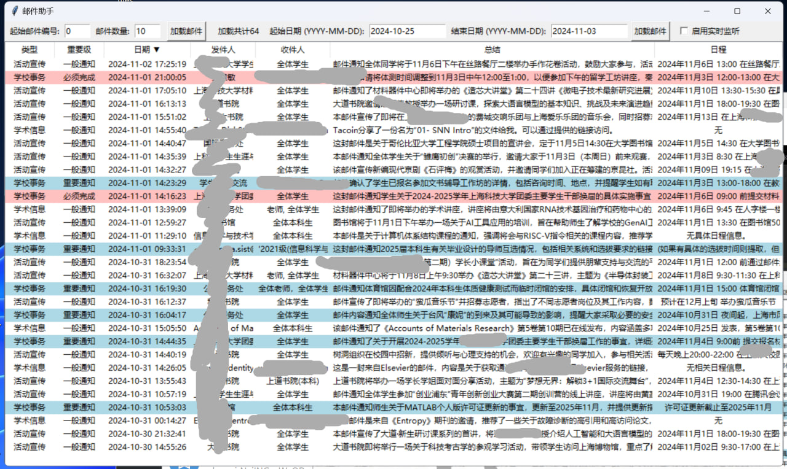

# AI-email-assistant

 e-Mail Assistant with ChatGPT

An intelligent email assistant to help users efficiently identify and prioritize important emails. By analyzing content, sender information, and subject lines, the system automatically categorizes emails, assigns priority levels, and generates concise summaries.


因为学校邮件天天一大堆讲座宣传什么的，经常会耽误了去看重要信息，所以就想做一个智能分类器，核心是去区分邮件的重要级，防止漏掉重要邮件。 邮件总结其实是为了gpt误判后人工审核的，加了之后发现确实不错。



一个雏形，目前没有精力去完整的做完这个项目。 GPT4o-mini非常便宜，开发期间处理了423封邮件，输入(312,446+113,920) tokens,输出49,269 tokens, 消费$0.08.

需要创建一个 `.config`  文件，内容如下，换上自己的token

```
[EMAIL]
IMAP_SERVER = imap.xxx
EMAIL_ACCOUNT = username@mail
EMAIL_PASSWORD = password

[OPENAI]
API_KEY = sk-xxxxxxxx
```

## Runtime:

### From source code:

python>3.8 环境（openai库要求）

```
pip install -r requirements.txt

```

然后运行main.py

### From build

Windows calendar.exe文件
